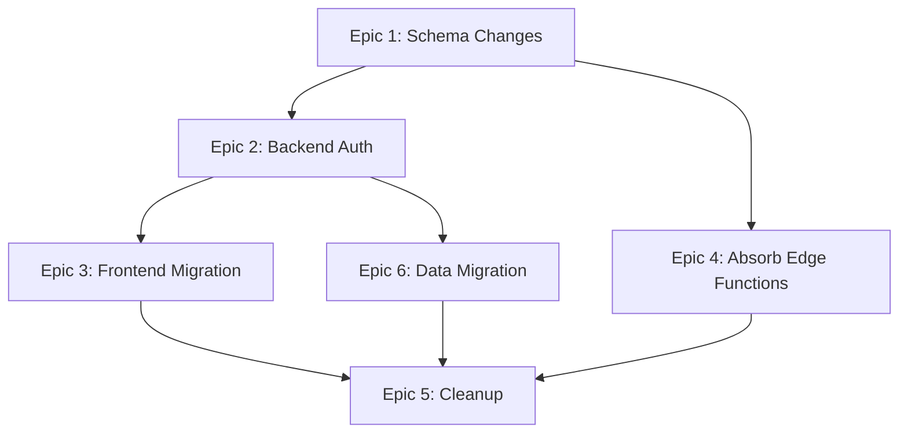

# OxyCorp — Supabase Removal & Self-Hosted Auth Migration Plan

> **Author:** Winston (System Architect)
> **Date:** 2026-05-12
> **Status:** Draft — awaiting Lulz review

---

## Executive Summary

Remove all Supabase dependencies and replace with self-hosted authentication powered by NestJS + Passport + bcrypt + JWT. The game's existing PostgreSQL database (via Prisma) becomes the single source of truth for both identity and game data. Three legacy Supabase Edge Functions are absorbed into existing NestJS modules.

**Total estimated scope:** ~400 lines of new code, ~200 lines of modifications, ~800 lines deleted (Supabase boilerplate + edge functions).

---

## Current State Audit

### What Supabase Provides Today

| Service | Used? | Details |
|---------|-------|---------|
| **Auth (GoTrue)** | ✅ Heavy | JWT issuance, session management, Discord OAuth, signup/login |
| **PostgreSQL** | ✅ Indirect | Hosts the DB, but accessed exclusively via Prisma — no Supabase client queries |
| **Edge Functions** | ✅ Light | 3 Deno functions: `mineRock` (commented out), `enterTown`, `leaveTown` |
| **Realtime** | ❌ | Not used — Socket.io handles all real-time |
| **Storage** | ❌ | Not used |
| **RPC / PostgREST** | ❌ | Not used |

### Supabase Touchpoints (Complete Inventory)

**Backend (4 files):**
- [auth.module.ts](file:///home/lulz/Project/OxyCorp/apps/api/src/auth/auth.module.ts) — `SUPABASE_JWT_SECRET` env var
- [jwt.strategy.ts](file:///home/lulz/Project/OxyCorp/apps/api/src/auth/jwt.strategy.ts) — `SUPABASE_JWT_SECRET` env var
- [ws-jwt.guard.ts](file:///home/lulz/Project/OxyCorp/apps/api/src/auth/ws-jwt.guard.ts) — `SUPABASE_JWT_SECRET` env var
- [chat.gateway.ts](file:///home/lulz/Project/OxyCorp/apps/api/src/chat/chat.gateway.ts) — `SUPABASE_JWT_SECRET` env var

**Frontend (21 files):**
- [lib/supabase.ts](file:///home/lulz/Project/OxyCorp/apps/web/src/lib/supabase.ts) — Supabase client singleton
- [App.tsx](file:///home/lulz/Project/OxyCorp/apps/web/src/App.tsx) — `getSession()`, `onAuthStateChange()`, `Session` type
- [AuthPage.tsx](file:///home/lulz/Project/OxyCorp/apps/web/src/components/AuthPage.tsx) — `@supabase/auth-ui-react` login widget
- 17 widgets/pages — all call `supabase.auth.getSession()` solely to extract `session.access_token` for Bearer headers

**Edge Functions (3 Deno functions):**
- `mineRock/index.ts` — fully commented out, dead code
- `enterTown/index.ts` — reads/creates `town_snapshots` row
- `leaveTown/index.ts` — upserts player position to `town_snapshots`

**Environment Variables:**
- `VITE_SUPABASE_URL` — frontend
- `VITE_SUPABASE_ANON_KEY` — frontend
- `SUPABASE_JWT_SECRET` — backend (4 references)

**NPM Packages to Remove:**
- `@supabase/supabase-js` (web)
- `@supabase/auth-ui-react` (web)
- `@supabase/auth-ui-shared` (web)

---

## Architecture After Migration

```
┌─────────────────┐        ┌────────────────────────────────────┐
│   React App     │        │         NestJS API                  │
│                 │        │                                      │
│  Custom Login   │──POST──▶  /api/auth/register                 │
│  Form           │        │  /api/auth/login                    │
│  (OxyCorp UI)   │        │  /api/auth/discord (OAuth)          │
│                 │◀───────│  /api/auth/discord/callback         │
│  Zustand        │        │  /api/auth/refresh                  │
│  useAuthStore() │        │  /api/auth/me                       │
│  holds JWT +    │        │                                      │
│  refresh token  │        │  JwtService.sign() → issues JWT     │
│                 │        │  JwtStrategy → verifies JWT          │
│  getToken()     │        │  bcrypt → password hashing           │
│  helper for     │        │                                      │
│  API calls      │        │  Prisma User model = identity store  │
└─────────────────┘        └──────────────┬───────────────────────┘
                                          │
                                          ▼
                              ┌───────────────────┐
                              │  Self-Hosted       │
                              │  PostgreSQL        │
                              │  (same DB as now)  │
                              └───────────────────┘
```

---

## Epic Breakdown

### Epic 1: Prisma Schema — Add Auth Fields to User Model

> [!IMPORTANT]
> This must land first. All other epics depend on it.

**Goal:** Extend the existing `User` model to store credentials (password hash) and refresh tokens. No new tables needed — we're adding fields to the existing model.

#### Story 1.1: Add auth fields to Prisma schema

**Changes to** [schema.prisma](file:///home/lulz/Project/OxyCorp/apps/api/prisma/schema.prisma):

```diff
 model User {
   id             String      @id @default(uuid())
   username       String      @unique
+  email          String?     @unique
+  passwordHash   String?     @map("password_hash")
+  discordId      String?     @unique @map("discord_id")
+  refreshToken   String?     @map("refresh_token")
   credits        BigInt      @default(1000)
   bunker_level   Int         @default(1)
   // ... rest unchanged
 }
```

**Design decisions:**
- `email` is separate from `username` — currently username IS the email, but going forward players should pick a display name
- `passwordHash` is nullable — Discord-only users won't have one
- `discordId` — stores the Discord user ID for OAuth linkage
- `refreshToken` — hashed refresh token for rotation

**Acceptance criteria:**
- [ ] Migration runs cleanly against existing data
- [ ] Existing users retain all their data
- [ ] `npx prisma migrate dev` succeeds

---

### Epic 2: Backend — NestJS Auth Service & Endpoints

**Goal:** NestJS becomes the JWT issuer. Add registration, login, Discord OAuth, and refresh endpoints.

#### Story 2.1: Install bcrypt dependency

```bash
cd apps/api && npm install bcrypt && npm install -D @types/bcrypt
```

#### Story 2.2: Create AuthService

**New file:** `apps/api/src/auth/auth.service.ts`

Responsibilities:
- `register(email, username, password)` → hash password, create User via Prisma, return JWT pair
- `login(email, password)` → validate credentials, return JWT pair
- `refresh(refreshToken)` → validate refresh token, rotate, return new JWT pair
- `validateDiscordUser(discordProfile)` → find-or-create user by `discordId`, return JWT pair
- Private: `generateTokens(userId, email)` → `{ accessToken, refreshToken }`

**Token strategy:**
- Access token: 15 min expiry, contains `{ sub: userId, email, username }`
- Refresh token: 7 day expiry, stored as bcrypt hash in DB

#### Story 2.3: Create AuthController

**New file:** `apps/api/src/auth/auth.controller.ts`

| Endpoint | Method | Auth | Description |
|----------|--------|------|-------------|
| `/api/auth/register` | POST | Public | `{ email, username, password }` → tokens |
| `/api/auth/login` | POST | Public | `{ email, password }` → tokens |
| `/api/auth/refresh` | POST | Public | `{ refreshToken }` → new tokens |
| `/api/auth/me` | GET | JWT | Returns current user profile |
| `/api/auth/logout` | POST | JWT | Invalidates refresh token |
| `/api/auth/discord` | GET | Public | Redirects to Discord OAuth |
| `/api/auth/discord/callback` | GET | Public | Discord callback → tokens |

#### Story 2.4: Install and configure passport-discord

```bash
cd apps/api && npm install passport-discord && npm install -D @types/passport-discord
```

**New file:** `apps/api/src/auth/discord.strategy.ts`

- Uses `passport-discord` to handle OAuth flow
- Callback creates or links user in Prisma
- Returns JWT pair via redirect (set as URL params or HTTP-only cookie)

**Required Discord Developer Portal config:**
- Redirect URI: `http://localhost:3000/api/auth/discord/callback` (dev), production URL for prod

#### Story 2.5: Mark auth endpoints as public (skip JWT guard)

The global `JwtAuthGuard` (set as `APP_GUARD`) protects all routes. Auth endpoints need to be excluded.

**Create decorator:** `apps/api/src/auth/public.decorator.ts`

```typescript
import { SetMetadata } from '@nestjs/common';
export const IS_PUBLIC_KEY = 'isPublic';
export const Public = () => SetMetadata(IS_PUBLIC_KEY, true);
```

**Modify** jwt-auth.guard to check for `IS_PUBLIC_KEY` metadata and skip if present.

#### Story 2.6: Update env vars

**Rename/replace:**
- `SUPABASE_JWT_SECRET` → `JWT_SECRET` (all 4 backend references)
- Add: `JWT_REFRESH_SECRET`
- Add: `DISCORD_CLIENT_ID`, `DISCORD_CLIENT_SECRET`, `DISCORD_CALLBACK_URL`
- Remove: `VITE_SUPABASE_URL`, `VITE_SUPABASE_ANON_KEY`

**Files affected:**
- [auth.module.ts](file:///home/lulz/Project/OxyCorp/apps/api/src/auth/auth.module.ts#L10)
- [jwt.strategy.ts](file:///home/lulz/Project/OxyCorp/apps/api/src/auth/jwt.strategy.ts#L8)
- [ws-jwt.guard.ts](file:///home/lulz/Project/OxyCorp/apps/api/src/auth/ws-jwt.guard.ts#L24)
- [chat.gateway.ts](file:///home/lulz/Project/OxyCorp/apps/api/src/chat/chat.gateway.ts#L32)
- [.env](file:///home/lulz/Project/OxyCorp/.env)

#### Story 2.7: Update AuthModule to wire everything

**Modify** [auth.module.ts](file:///home/lulz/Project/OxyCorp/apps/api/src/auth/auth.module.ts):

```diff
 @Module({
   imports: [
     PassportModule,
+    PrismaModule,
     JwtModule.register({
-      secret: process.env.SUPABASE_JWT_SECRET || 'super-secret-jwt-key',
+      secret: process.env.JWT_SECRET || 'super-secret-jwt-key',
       signOptions: { expiresIn: '15m' },
     }),
   ],
-  providers: [JwtStrategy],
-  exports: [PassportModule, JwtModule],
+  providers: [JwtStrategy, DiscordStrategy, AuthService],
+  controllers: [AuthController],
+  exports: [PassportModule, JwtModule, AuthService],
 })
```

---

### Epic 3: Frontend — Auth Store & Login UI

**Goal:** Replace all `supabase.auth.getSession()` calls with a centralized Zustand auth store. Replace the Supabase auth UI widget with a custom OxyCorp login form.

#### Story 3.1: Create Zustand auth store

**New file:** `apps/web/src/stores/authStore.ts`

```typescript
interface AuthState {
  accessToken: string | null;
  user: { id: string; email: string; username: string } | null;
  isAuthenticated: boolean;
  isLoading: boolean;

  // Actions
  login: (email: string, password: string) => Promise<void>;
  register: (email: string, username: string, password: string) => Promise<void>;
  loginWithDiscord: () => void;
  logout: () => Promise<void>;
  refresh: () => Promise<void>;
  getToken: () => string | null;
  initialize: () => Promise<void>;  // check localStorage for refresh token on app boot
}
```

**Token storage strategy:**
- Access token: in-memory (Zustand state) — never in localStorage
- Refresh token: `localStorage` (acceptable for game, not a banking app)
- On app boot: `initialize()` attempts a silent refresh

#### Story 3.2: Create custom AuthPage / Login UI

**Rewrite** [AuthPage.tsx](file:///home/lulz/Project/OxyCorp/apps/web/src/components/AuthPage.tsx):

- Custom form matching OxyCorp's grimdark aesthetic ("MOLOCH PROTOCOL" branding)
- Email + password fields with register/login toggle
- "Sign in with Discord" button
- Uses `useAuthStore()` actions
- No Supabase UI library dependency

#### Story 3.3: Update App.tsx to use auth store

**Modify** [App.tsx](file:///home/lulz/Project/OxyCorp/apps/web/src/App.tsx):

```diff
- import { supabase } from './lib/supabase'
- import type { Session } from '@supabase/supabase-js'
+ import { useAuthStore } from './stores/authStore'

  export default function App() {
-   const [session, setSession] = useState<Session | null>(null)
-   const [loading, setLoading] = useState(true)
+   const { isAuthenticated, isLoading, initialize } = useAuthStore()

    useEffect(() => {
-     supabase.auth.getSession().then(...)
-     supabase.auth.onAuthStateChange(...)
+     initialize()  // attempt silent refresh from stored refresh token
    }, [])
```

#### Story 3.4: Create API helper with auto-auth

**New file:** `apps/web/src/lib/api.ts`

```typescript
import { useAuthStore } from '../stores/authStore';

const API_BASE = import.meta.env.VITE_API_URL || 'http://localhost:3000/api';

export async function apiFetch(path: string, options: RequestInit = {}) {
  const token = useAuthStore.getState().getToken();
  const res = await fetch(`${API_BASE}${path}`, {
    ...options,
    headers: {
      'Content-Type': 'application/json',
      ...(token ? { Authorization: `Bearer ${token}` } : {}),
      ...options.headers,
    },
  });

  // Auto-refresh on 401
  if (res.status === 401) {
    await useAuthStore.getState().refresh();
    const newToken = useAuthStore.getState().getToken();
    if (newToken) {
      return fetch(`${API_BASE}${path}`, {
        ...options,
        headers: {
          'Content-Type': 'application/json',
          Authorization: `Bearer ${newToken}`,
          ...options.headers,
        },
      });
    }
  }
  return res;
}
```

#### Story 3.5: Replace supabase.auth.getSession() across all widgets

**17 files to update.** Every file follows the same pattern:

```diff
- import { supabase } from '../lib/supabase';
+ import { apiFetch } from '../lib/api';

  // Before:
- const { data: { session } } = await supabase.auth.getSession();
- if (!session) return;
- const res = await fetch('http://localhost:3000/api/...', {
-   headers: { Authorization: `Bearer ${session.access_token}` },
- });

  // After:
+ const res = await apiFetch('/...');
```

**Complete file list:**

| # | File | `getSession()` calls | Other supabase usage |
|---|------|---------------------|---------------------|
| 1 | `Dashboard.tsx` | 2 | `signOut()` |
| 2 | `MiningWidget.tsx` | 3 | — |
| 3 | `MarketWidget.tsx` | 3 | — |
| 4 | `RefiningWidget.tsx` | 3 | — |
| 5 | `FacilitiesWidget.tsx` | 2 | — |
| 6 | `SkillsWidget.tsx` | 2 | — |
| 7 | `DirectivesWidget.tsx` | 3 | — |
| 8 | `SectorDetailPanel.tsx` | 4 | — |
| 9 | `MapGrid.tsx` | 1 | — |
| 10 | `SellModal.tsx` | 1 | — |
| 11 | `ChatContext.tsx` | 1 | — |
| 12 | `WarRoom.tsx` | 2 | — |
| 13 | `ControlCenterTerminal.tsx` | 1 | — |
| 14 | `BunkerManagementTerminal.tsx` | 1 | — |
| 15 | `MapTerminal.tsx` | 1 | — |
| 16 | `MarketTerminal.tsx` | 1 | — |
| 17 | `EquipmentWidget.tsx` | 2 | — |

> [!TIP]
> This is highly mechanical — the `apiFetch()` helper makes each file change a 2-line diff. A find-and-replace can handle most of it.

#### Story 3.6: Update ChatContext for new auth

**Modify** [ChatContext.tsx](file:///home/lulz/Project/OxyCorp/apps/web/src/context/ChatContext.tsx):

```diff
- const { data: { session } } = await supabase.auth.getSession();
- if (!session) return;
- socketInstance = io('http://localhost:3000/chat', {
-   extraHeaders: { Authorization: `Bearer ${session.access_token}` },
-   query: { token: session.access_token }
- });
+ const token = useAuthStore.getState().getToken();
+ if (!token) return;
+ socketInstance = io('http://localhost:3000/chat', {
+   extraHeaders: { Authorization: `Bearer ${token}` },
+   query: { token }
+ });
```

---

### Epic 4: Absorb Edge Functions into NestJS

**Goal:** Port `enterTown` and `leaveTown` into the existing NestJS `MapModule` (or a new `TownModule`). Delete `mineRock` (already dead code).

#### Story 4.1: Add TownSnapshot model to Prisma schema (if not present)

> [!NOTE]
> The `enterTown`/`leaveTown` functions reference a `town_snapshots` table that isn't in the current Prisma schema. This table exists in Supabase but was managed outside Prisma. We need to either add it to the schema or verify it's no longer needed.

```prisma
model TownSnapshot {
  id        String   @id @default(uuid())
  playerId  String   @unique @map("player_id")
  posX      Float    @default(0) @map("pos_x")
  posY      Float    @default(0) @map("pos_y")
  posZ      Float    @default(0) @map("pos_z")
  rotY      Float    @default(0) @map("rot_y")

  player    User     @relation(fields: [playerId], references: [id])

  @@map("town_snapshots")
}
```

#### Story 4.2: Create TownController in MapModule

**New file:** `apps/api/src/map/town.controller.ts`

| Endpoint | Method | Description |
|----------|--------|-------------|
| `/api/map/town/enter` | POST | Returns spawn position (replaces `enterTown` edge function) |
| `/api/map/town/leave` | POST | Saves player position (replaces `leaveTown` edge function) |

~30 lines each — direct port of the edge function logic, but using Prisma instead of Supabase client.

#### Story 4.3: Delete mineRock edge function

Already commented out. Pure deletion.

---

### Epic 5: Cleanup & Dependency Removal

#### Story 5.1: Remove Supabase NPM packages from web

```bash
cd apps/web && npm uninstall @supabase/supabase-js @supabase/auth-ui-react @supabase/auth-ui-shared
```

#### Story 5.2: Delete Supabase files and directories

```
DELETE: supabase/                     (entire directory — config.toml, functions/, .temp/)
DELETE: apps/web/src/lib/supabase.ts  (client singleton)
```

#### Story 5.3: Update environment variables

**Modify** [.env](file:///home/lulz/Project/OxyCorp/.env):

```diff
- VITE_SUPABASE_URL="http://lulz.space:8000/"
- VITE_SUPABASE_ANON_KEY="eyJ..."
+ VITE_API_URL="http://localhost:3000/api"
+ JWT_SECRET="<generate-a-strong-secret>"
+ JWT_REFRESH_SECRET="<generate-another-strong-secret>"
+ DISCORD_CLIENT_ID="<your-discord-app-id>"
+ DISCORD_CLIENT_SECRET="<your-discord-app-secret>"
+ DISCORD_CALLBACK_URL="http://localhost:3000/api/auth/discord/callback"
```

#### Story 5.4: Update project-context.md

**Modify** [project-context.md](file:///home/lulz/Project/OxyCorp/_bmad-output/project-context.md):

- Remove all Supabase references from technology stack
- Update auth description: "NestJS owns auth (bcrypt + Passport + JWT)"
- Remove "Supabase Vault" from secrets management
- Update env var documentation

#### Story 5.5: Stop Supabase services

If self-hosting Supabase on `lulz.space`, stop and remove the Docker containers / systemd services. Keep PostgreSQL running standalone.

---

### Epic 6: Data Migration (Existing Users)

> [!WARNING]
> If you have existing users in Supabase Auth that aren't in your Prisma `User` table, they need to be migrated. Based on your current code, `onboardUser()` creates users in Prisma with the Supabase user ID as the primary key — so your Prisma users and Supabase auth users share the same UUID.

#### Story 6.1: Export Supabase auth users

```sql
-- Run against Supabase PostgreSQL
SELECT id, email, encrypted_password, raw_user_meta_data->>'provider' as provider
FROM auth.users;
```

#### Story 6.2: Backfill auth fields on existing Prisma users

Migration script that:
1. For each Supabase `auth.users` row, updates the matching Prisma `User` with `email`, `passwordHash` (copy the bcrypt hash directly — Supabase uses bcrypt too), and `discordId` if applicable
2. Handles edge cases (users in auth but not in game, or vice versa)

---

## Implementation Order



**Recommended sprint sequence:**

| Sprint | Epics | Rationale |
|--------|-------|-----------|
| **Sprint 1** | Epic 1 + Epic 2 | Schema + backend auth. Can test with Postman/curl independently. |
| **Sprint 2** | Epic 3 + Epic 4 | Frontend swap + edge function absorption. Old Supabase still runs as fallback. |
| **Sprint 3** | Epic 6 + Epic 5 | Data migration, then delete everything Supabase. |

> [!TIP]
> During Sprint 2, both auth systems can coexist — the frontend can be migrated component by component while the old Supabase auth still works. This de-risks the migration.

---

## Risk Assessment

| Risk | Likelihood | Impact | Mitigation |
|------|-----------|--------|------------|
| Existing user passwords can't be migrated | Low | High | Supabase uses bcrypt — hashes are directly compatible. Verify with a test user. |
| Discord OAuth callback URL mismatch | Medium | Low | Update Discord Developer Portal before switching. Test in dev first. |
| Token refresh race conditions | Medium | Medium | The `apiFetch()` helper serializes refresh attempts. Add a mutex if needed. |
| Missed supabase reference in codebase | Low | Low | `grep -r "supabase"` as final verification step. |
| `town_snapshots` table data loss | Low | Medium | Export data before deleting Supabase. Verify table exists in the standalone Postgres. |

---

## Verification Checklist

After migration is complete:

- [ ] `grep -ri "supabase" apps/` returns zero results
- [ ] `grep -ri "SUPABASE" apps/` returns zero results
- [ ] No `@supabase/*` packages in any `package.json`
- [ ] `supabase/` directory is deleted
- [ ] New user can register with email/password
- [ ] New user can sign in with Discord
- [ ] Existing users can log in (password hash compatibility)
- [ ] JWT tokens are issued and verified correctly
- [ ] Refresh token rotation works
- [ ] All 17 widgets fetch data without auth errors
- [ ] Chat WebSocket connects with new JWT
- [ ] Town enter/leave endpoints work
- [ ] `npx prisma migrate deploy` succeeds in prod
