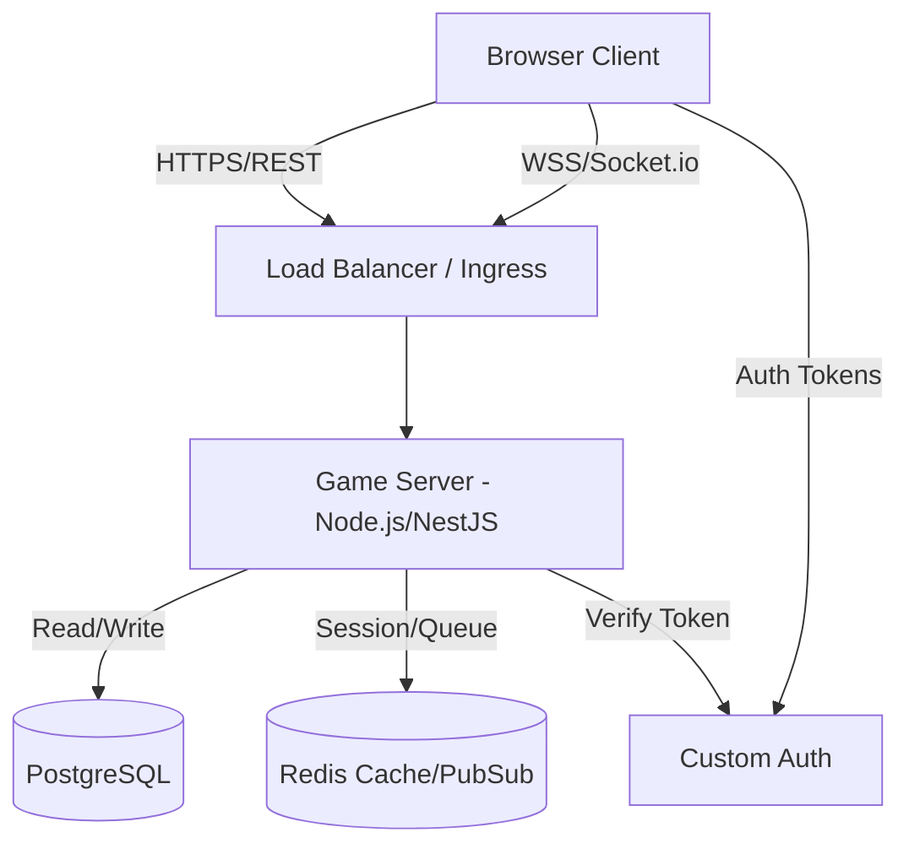
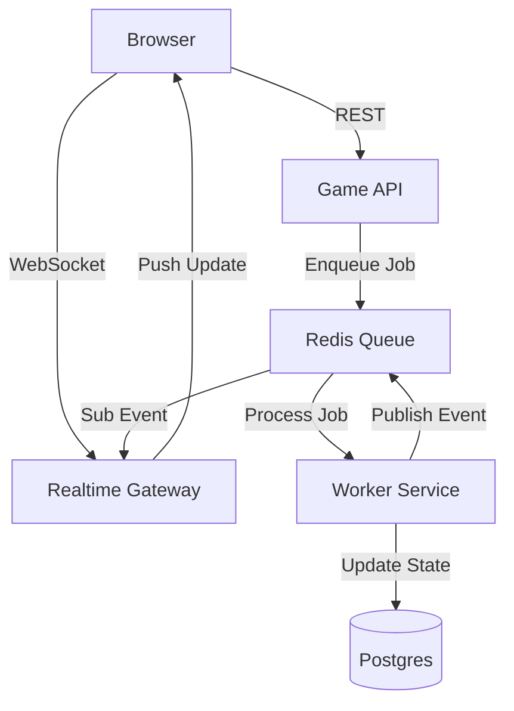
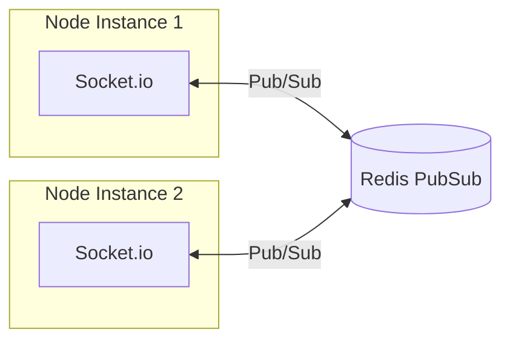

# Moloch Architecture Document

## 1. Introduction

This document outlines the overall project architecture for **Moloch**, a Techno-Gothic browser-based MMORPG. It serves as the guiding blueprint for development, primarily focusing on the backend systems, data models, and infrastructure required to support the "Triangle of Efficiency" economy.

**Reference:** This architecture is based on the [Project Brief](docs/brief.md) and [Competitor Analysis](docs/competitor-analysis.md).

**Starter Template:** N/A (Greenfield implementation using best-practice scaffolding).

## 2. High Level Architecture

### Technical Summary

Moloch utilizes a **Modular Monolith** architecture to balance development speed with future scalability. The system is built on a **Node.js/TypeScript** backend exposing both RESTful endpoints and real-time **WebSockets** (via Socket.io) to a **React** frontend. Data persistence is handled by **PostgreSQL**, leveraging its strong relational capabilities.

### High Level Project Diagram

### Architectural and Design Patterns

- **Modular Monolith:** The backend will be structured as distinct modules (Economy, Combat, User) within a single deployable unit.
  - _Rationale:_ Eliminates the distributed system complexity of microservices for the MVP phase while ensuring code domains stay separated for potential future splitting.
- **Event-Driven Architecture (Internal):** Use an internal Event Bus for system decoupling (e.g., `HarvestCompleted` event triggers `InventoryUpdate`).
  - _Rationale:_ Critical for the "Asynchronous" nature of the game; allows the "Auto-Battler" results to process independently of user session.
- **Repository Pattern:** Abstract database access behind typed repositories.
  - _Rationale:_ Decouples game logic from PostgreSQL/Prisma specifics, allowing easier testing and schema evolution.
- **Optimistic UI Updates:** Frontend assumes success for high-frequency actions (like market bids) while the backend validates asynchronously.
  - _Rationale:_ Essential to make the browser game feel "responsive" and not sluggish like a typical web app.

## 3. Tech Stack

### Cloud Infrastructure

- **Provider:** Self-hosted.
- **Key Services:**
  - **Database & Auth:** Managed PostgreSQL & Custom Auth.
  - **Game Server Compute:** Self-hosted (Persistent Node.js instances).
  - **Frontend Hosting:** Vercel.
- **Deployment Regions:** EU-West (Ireland) - Central hub to minimize latency variance.

### Technology Stack Table

| Category       | Technology | Version     | Purpose            | Rationale                                                                         |
| :------------- | :--------- | :---------- | :----------------- | :-------------------------------------------------------------------------------- |
| **Language**   | TypeScript | 5.3+        | Full Stack Dev     | Single language for FE/BE, strong typing for complex economy logic.               |
| **Runtime**    | Node.js    | 20.11 (LTS) | Backend Runtime    | Stable, performant async I/O perfect for game loops.                              |
| **Framework**  | NestJS     | 10.3+       | Backend Framework  | Enforces "Modular Monolith" structure. Built-in WebSocket support.                |
| **Database**   | PostgreSQL | 15+         | Primary Data Store | Relational integrity is non-negotiable for an economy game.       |
| **ORM**        | Prisma     | 5.9+        | Data Access        | Type-safe database queries. Reduces class of errors related to schema mismatches. |
| **Realtime**   | Socket.io  | 4.7+        | Game State Sync    | Robust event-based communication for battle updates/market ticks.                 |
| **State Mgmt** | Zustand    | 4.5+        | Frontend State     | Simpler than Redux, perfect for rapid game state mutations.                       |
| **Tooling**    | Turborepo  | Latest      | Monorepo Tool      | Manages build/dev pipeline for the separated Client/Server structure.             |

## 4. Data Models

### User & Bunker

**Purpose:** Represents the player and their persistent base on Mars.

- `id`: UUID
- `username`: String (Unique)
- `credits`: BigInt (Primary currency)
- `specialization`: Enum (COGITATOR | FORGE | MERCHANT)
- `bunker_level`: Int
  **Relationships:** Has One `Inventory`, Has Many `DroneSwarms`

### Inventory & Items

**Purpose:** The core storage of the game.

- `item_id`: Enum/String (e.g., 'IRON_ORE', 'AI_CHIP_V1')
- `quantity`: BigInt
- `quality`: Int (Optional)
  **Relationships:** Belongs to `User`, Belongs to `MarketListing` (Escrow)

### Market Listing

**Purpose:** The global exchange where players trade.

- `id`: UUID
- `seller_id`: UUID
- `price_per_unit`: BigInt
- `is_buy_order`: Boolean
- `expires_at`: Timestamp

### Drone Swarm

**Purpose:** An "Auto-Battler" unit definition.

- `formation`: JSON (Programmed behavior/grid layout)
- `drones`: JSON (Array of drone IDs/Stats)
- `status`: Enum (IDLE | DEPLOYED | DESTROYED)

### Drone Variant (Drone Stats)

**Purpose:** Defines base statistics for drone types (replacing hardcoded values).

- `id`: String (PK) - Matches `item` ID (e.g., 'DRONE_ATTACK_V1')
- `name`: String
- `attack`: Int
- `defense`: Int
- `speed`: Int
- `health`: Int
- `description`: String
- `created_at`: Timestamp

### Chat Message

**Purpose:** Stores global chat messages for history and moderation.

- `id`: UUID
- `user_id`: UUID (FK to User)
- `content`: String (max 500 chars)
- `created_at`: Timestamp
- `is_deleted`: Boolean (for soft-delete/moderation)

### Sector (Map Grid)

**Purpose:** Represents a coordinate on the global Mars grid.

- `x`: BigInt (Constraint: Unique [x, y])
- `y`: BigInt
- `type`: Enum (EMPTY, BUNKER, RESOURCE, POI)
- `occupier_id`: UUID (FK to User, Nullable) - For claimed plots
- `resources`: JSON (e.g., `{ "iron": 0.8, "copper": 0.1 }`)

### Claim (Industrial Ownership)

**Purpose:** Tracks player ownership of map sectors.

- `id`: UUID
- `sector_x`: BigInt
- `sector_y`: BigInt
- `owner_id`: UUID (FK to User)
- `claimed_at`: Timestamp
- `name`: String (Optional custom name)

### Refining Job

**Purpose:** Tracks active refining processes (The Forge).

- `id`: UUID
- `user_id`: UUID
- `recipe_id`: Enum (e.g., 'IRON_TO_STEEL')
- `start_time`: Timestamp
- `end_time`: Timestamp
- `status`: Enum (PROCESSING | COMPLETED | COLLECTED)

### User Skills (Neural Conditioning)

**Purpose:** Stores player specialization progress.

- `user_id`: UUID
- `skill_node_id`: String (e.g., 'COGITATOR_RAPID_EXTRACTION')
- `level`: Int (Current rank)

### Bunker Facility

**Purpose:** Tracks the upgrade level of bunker buildings.

- `user_id`: UUID
- `facility_type`: Enum (REFINING_VAT, COMMAND_ARRAY, LOGISTICS_HUB)
- `level`: Int

### Quest Progress (Directives)

**Purpose:** Tracks mission state.

- `id`: UUID
- `user_id`: UUID
- `quest_id`: String
- `status`: Enum (ACTIVE | COMPLETED | FAILED)
- `current_progress`: Int (e.g., delivered 50/100)

## 5. Components

### Game API (The Brain)

**Responsibility:** Handles all REST requests (User management, Inventory actions, Market listing, Map data).
**Interfaces:**

- `POST /api/market/order`
- `GET /api/user/profile`
- `GET /api/map/sectors` (Grid View)
- `POST /api/map/claim` (Land Ownership)
  **Technology:** NestJS (HTTP Module)

### Realtime Gateway (The Nervous System)

**Responsibility:** Manages WebSocket connections for live updates (Chat, Market Ticker, Battle Results).
**Interfaces:**

- `Socket.on('chat:join')` - Join global room
- `Socket.on('chat:message')` - Send message
- `Socket.emit('chat:broadcast')` - Receive message
- `Socket.emit('market:tick')` - Market price update
- `Socket.emit('battle:result')` - Combat resolution
  **Technology:** NestJS (Gateway Module + Socket.io + Redis Adapter)

### Worker Service (The Muscle)

**Responsibility:** Background processing (TGR Combat Resolution, Harvest Timers, Refining Jobs).
**Technology:** Node.js (BullMQ/Redis for job queueing).

### Skill Service (The Cortex)

**Responsibility:** Calculates dynamic stats based on User Skills (e.g., `getEfficientHarvestRate(user)`).
**Caching:** Heavy use of Redis to cache computed modifier tables per user.

### Tactical Grid Resolver (TGR)

**Responsibility:** Deterministic combat simulation on the 5x5 grid.
**Input:** `SwarmA` (JSON), `SwarmB` (JSON).
**Output:** `BattleLog` (JSON) containing turn-by-turn state changes.

### Component Diagram

## 6. Infrastructure and Deployment

### Deployment Strategy

- **Strategy:** Rolling Update
- **CI/CD:** GitHub Actions
- **Pipeline:** Lint/Test -> Build Docker -> Deploy to Staging -> Prod

### WebSocket Scaling (Redis Adapter)

**Problem:** If we scale to multiple Node.js instances, Socket.io rooms will not sync across them (User A on Server 1 won't see User B on Server 2).
**Solution:** `@socket.io/redis-adapter`

**Implementation:**

1. Add `@socket.io/redis-adapter` to NestJS Gateway.
2. Configure Redis connection (same instance as job queue).
3. All `emit` calls are automatically synced across instances.

## 7. Security

### Authentication & Authorization

- **Auth Method:** Custom JWT Auth
- **Pattern:** Client sends JWT in Header. NestJS Guard verifies signature + User ID.

### Secrets Management

- **Production:** Environment Variables (Self-hosted) / Vault
- **Code Requirements:** NO .ENV files in repo.

## 8. Algorithmic Strategies

### Map Spawning (The Frontier)

- **Pattern:** Spiral Outward or Expanding Ring.
- **Logic:** `NewSpawn(User)` selects `(x, y)` such that:
  - `Distance(NewParams, ExistingBunkers) > MinSafeDistance`
  - `(x, y)` is EMPTY type.
- **Persistence:** Generated sectors are saved to DB to prevent double-booking.

## 9. Next Steps

### Frontend Architect Handoff

Base the frontend design on this architecture.

1. **Optimistic UI:** Zustand stores update immediately, rollback on API failure.
2. **Socket Handling:** Create `SocketProvider` with reconnection logic.
3. **Visualization:** Plan for "Three.js Canvas" overlay with React UI.
