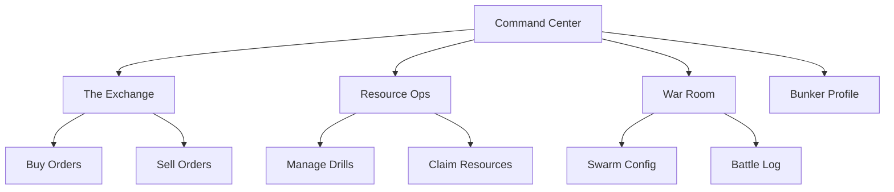
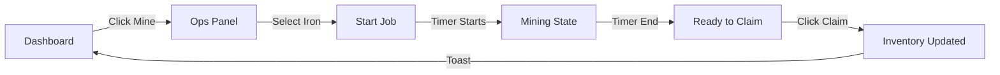
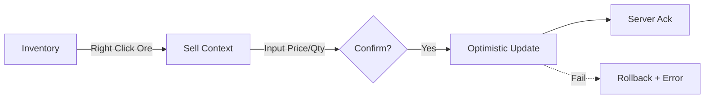

# Moloch UI/UX Specification

## 1. Introduction

This document defines the user experience goals, information architecture, user flows, and visual design specifications for **Moloch**'s user interface. It serves as the foundation for visual design and frontend development, ensuring a cohesive and user-centered experience.

### Change Log

| Date       | Version | Description   | Author    |
| :--------- | :------ | :------------ | :-------- |
| 2026-01-22 | 1.0     | Initial Draft | UX Expert |

## 2. Overall UX Goals & Principles

### Target User Personas

- **The Lunch Break Warlord:** Busy professional, playing on work laptop or phone during breaks. Values speed, clarity, and "pause-ability."
- **The Mobile Tycoon:** Commuter playing purely on mobile. Values large touch targets and readable text.

### Usability Goals

- **Time-to-Action:** Users must be able to deploy a drone swarm or list an item in < 15 seconds.
- **Glanceability:** Dashboard must convey Net Worth, Threat Level, and Job Status instantly.
- **Error Tolerance:** "Fat finger" protection on high-value trades (confirmation sliders).

### Design Principles

1.  **Diegetic Immersion:** The UI _is_ the game. You aren't playing a game; you are operating a terminal in a bunker.
2.  **Dark Mode Default:** Low eye strain, high contrast neon for critical info.
3.  **No Spinners:** Optimistic UI for everything. If the network fails, we rollback and error toast.
4.  **Glitch Aesthetics:** Loading states and transitions should use "digital interference" effects rather than standard fades.

## 3. Information Architecture (IA)

### Site Map

### Navigation Structure

- **Primary (Desktop):** Sidebar (Left). Icons + Labels. Collapsible.
- **Primary (Mobile):** Bottom Tab Bar (Fixed). 4 Key Destinations: Command, Ops, Market, War.
- **Secondary:** Top Bar for Global Status (Credits, Notifications) + User Menu.

## 4. User Flows

### Flow: Harvesting Loop

**User Goal:** Start a mining job and claim rewards.
**Entry:** Dashboard -> Resource Ops Widget.
**Success:** Ore added to inventory.

### Flow: Market Listing

**User Goal:** Sell excess Iron Ore.
**Entry:** Inventory Context Menu or Market Page.

## 5. Wireframes & Mockups

**Primary Design Tool:** Figma (Link to be generated).

### Key Screen Layouts

#### Screen: The Command Center (Dashboard)

**Purpose:** The single-glance "Day start" screen.
**Key Elements:**

- **Status Ticker (Top):** Credits, Server Time, Online Players.
- **Job Widgets (Grid):** "Iron Drill: 4m remaining", "Copper Drill: READY".
- **Market Watchlist:** Price trends for favorite items.
- **Chat Drawer (Bottom Right):** Collapsible.
  **Interaction Notes:** Drag-and-drop widgets on Desktop. Vertical stack on Mobile.

#### Screen: The Exchange (Market)

**Purpose:** High-density data view for trading.
**Key Elements:**

- **Order Book:** Depth chart (Red/Green).
- **Recent Trades:** Scrolling list.
- **Order Form:** Fixed sidebar (Desktop) or Bottom Sheet (Mobile).
  **Interaction Notes:** Click on an order book row to auto-fill the price input.

## 6. Component Library / Design System

**Approach:** Custom implementation on top of Radix UI or React Aria (Headless) to allow full control over the "Cyber" aesthetic without fighting Material/Bootstrap overrides.

### Core Components

#### `CyberButton`

**Purpose:** Primary action trigger.
**Variants:** `Glitch` (Primary), `Holo` (Secondary), `Danger` (Red).
**States:** Idle, Hover (Glow), Active (Press), Disabled (Dimmed + Scanline).

#### `TerminalCard`

**Purpose:** Container for all content widgets.
**Visuals:** Thin border, corner accents, subtle CRTs scanline background.

#### `NeonText`

**Purpose:** Headers and Data values.
**Variants:** `Green` (Profit/Success), `Red` (Hostile/Loss), `Amber` (Warning/Attention).

#### `MatrixGrid`

**Purpose:** Layout container for the Swarm Editor.
**Behavior:** Draggable cells/slots for drone placement.

## 7. Branding & Style Guide

### Color Palette

| Type           | Hex       | Usage                                          |
| :------------- | :-------- | :--------------------------------------------- |
| **Background** | `#050505` | Infinite Black (OLED friendly)                 |
| **Surface**    | `#1A1A1A` | Terminal Backgrounds                           |
| **Primary**    | `#00FF9D` | (Cyber Green) Success, Profit, Primary Actions |
| **Secondary**  | `#00F3FF` | (Holo Cyan) Info, Selection, Active State      |
| **Accent**     | `#FF0055` | (Danger Red) Combat, Sell Orders, Errors       |
| **Text Main**  | `#E0E0E0` | Primary Content                                |
| **Text Muted** | `#808080` | Labels, Secondary Info                         |

### Typography

- **Headings:** `Oxanium` (Google Fonts) - Futuristic, angular.
- **Body:** `Share Tech Mono` or `JetBrains Mono` - Terminal feel, monospaced for numbers.

## 8. Responsiveness Strategy

- **Mobile First:** All layouts start as single column.
- **Tablet:** Two column grid (Sidebar + Content).
- **Desktop:** Three column (Sidebar + Content + Details/Chat).

## 9. Accessibility Requirements

### Compliance Target

**Standard:** WCAG 2.1 AA (Good for a visual heavy game, but must be useable).

### Key Requirements

- **Color Contrast:** All text must be at least 4.5:1 against the dark background. (Neon Green on Black is usually safe, verify Red).
- **Keyboard Nav:** The entire game loop (Harvest -> Market) must be playable via Tab + Enter.
- **Screen Reader:** All iconic buttons (Drill icon) must have `aria-label="Start Mining Iron"`.

## 10. Animation & Micro-interactions

### Motion Principles

- **Machine-Like:** Easing should be linear or "stepped" (simulating servos), not organic/bouncy.
- **Glitch on Update:** When data changes (Credits up), the number should briefly "glitch" or scramble before settling on the new value.
- **Instant Response:** Button press = Immediate sound/visual state change (0ms delay).

### Key Animations

- **The "Data Scramble":** text decoding effect on load.
- **The "CRT Turn On":** Screen flicker and line scan when opening a modal.
- **The "Drone Launch":** Smooth vector path animation on the map (Phase 2).

## 11. Performance Considerations

### Performance Goals

- **First Contentful Paint:** < 1.0s (Critical for retention).
- **Market Ticker:** 60fps scrolling, decoupled from React render cycle if possible (use direct DOM manipulation or Canvas if list > 100 items).
- **Bundle Size:** < 150kb initial load (Split chunks by Route).

## 12. Generative AI Prompts

### v0 / Lovable Prompt

> Create a dark sci-fi dashboard interface for a space economy game. Use a color palette of #050505 (background), #00FF9D (success), and #FF0055 (danger). The layout should have a left sidebar navigation with icon buttons. The main content area should show a grid of "Mining Drill" widgets. Each widget is a card with a thin border, a title "Iron Drill", a countdown timer "04:32", and a "Claim" button. Use a monospaced font like JetBrains Mono. Add a "glitch" effect on hover.

## 13. Next Steps

### Developer Handoff

1.  **Initialize Core UI Repo:** Set up the monorepo with Tailwind + Radix UI.
2.  **Color Token Setup:** Define the CSS variables for the Neon palette immediately.
3.  **Build "TerminalCard":** Create the foundational container component.

### UX Handoff Checklist

- [x] Personas & Goals defined.
- [x] Sitemap & Navigation structure locked.
- [x] Critical Flows (Harvest/Trade) mapped.
- [x] Visual Style (Colors/Fonts) selected.
