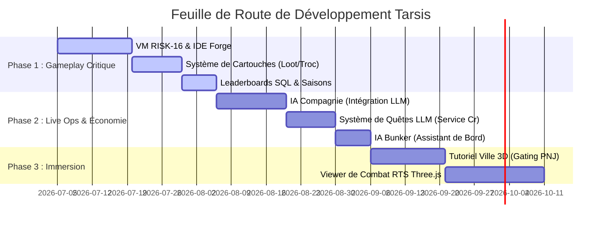

# Spécifications Fonctionnelles et Feuille de Route du Projet : Tarsis

Ce document sert de référence pour la gestion de projet et le développement des prochaines fonctionnalités de **Tarsis**. Il intègre les retours de conception et structure le développement en phases prioritaires.

---

## 1. Vision et Piliers de Game Design
*Tarsis* est conçu pour le profil **"Warlord de la Pause Déj"** (25-45 ans, sessions de <15 minutes). La boucle principale repose sur le concept de **"Solo-Market Loop"** : un gameplay individuel asynchrone qui alimente une macro-économie hautement interdépendante et compétitive.

---

## 2. Spécifications Détaillées des Fonctionnalités (Ajustées)

### F1. Programmation des Drones et Économie de Cartouches
*Le principal "sink" (destructeur) de ressources du jeu et le cœur du gameplay tactique.*
*   **IDE RISK-16 (Exclusivité Forge) :** Aucun éditeur de blocs visuels n'est disponible. L'accès à l'IDE textuel pour coder en RISK-16 est réservé exclusivement à la classe *Corpse-Fuelled Forge*.
*   **Système de Cartouches :**
    *   **Pour les non-programmeurs :** Des cartouches de logique de combat basiques (comportements simples de ciblage et de patrouille) sont récupérables (loot) via les quêtes.
    *   **Pour les joueurs avancés :** Les spécialistes *Forge* programment des scripts avancés sur des cartouches physiques et les vendent sur le marché global. L'efficacité des scripts prouvée en PvP dicte leur valeur marchande.
*   **Résolution des Combats :** Asynchrone et déterministe. Le serveur calcule le combat tick par tick et génère un rapport JSON.
*   **Régulation Économique (Perte Totale) :** En cas de défaite lors d'un combat territorial ou en Wild Plot, la perte des drones engagés est **totale et définitive**. Cela génère une destruction constante d'actifs, maintenant la demande de minage et de craft.

### F2. L'IA de la Compagnie (LLM & Économie)
*Le régulateur dynamique du marché et le moteur d'événements mondiaux.*
*   **Fonctionnement de l'IA :** Un Large Language Model (LLM) agit comme directeur de simulation. Il prend en entrée les chiffres clés du marché actuel (cours des minerais, volume de transactions, activité des joueurs) via un script automatisé.
*   **Événements et Quêtes :** L'IA prend des décisions macro-économiques (déclenchement de pénuries, tempêtes solaires, besoins militaires) et injecte des quêtes mondiales adéquates.
*   **Monnaie Territoriale :** La Compagnie achète des ressources spécifiques en échange de **Service Credits** (monnaie exclusive requise pour revendiquer des territoires et payer les frais de protection).

### F3. La Ville (Hub Social) et Tutoriel
*L'introduction physique au monde de Mars.*
*   **Le Tutoriel (Le Portail de la Ville) :** Au début du jeu, les joueurs doivent physiquement se déplacer dans la ville 3D pour interagir avec les PNJ (terminaux physiques). C'est le seul moyen d'accéder aux fonctionnalités (Marché, Fonderie, Swarms) afin de forcer l'apprentissage et l'immersion.
*   **Déverrouillage Post-Tuto :** Une fois le tutoriel validé et la dette initiale remboursée, toutes les fonctionnalités du HUD et du bunker privé deviennent accessibles à distance en un clic. Le déplacement physique en ville devient optionnel.

### F4. L'IA du Bunker (Machine Spirit)
*L'assistant de gestion hors-ligne diégétique.*
*   **Agrégateur de Notifications :** Traduit les événements système en rapports textuels immersifs dans l'ambiance techno-gothique.
*   **Rapport de Déconnexion :** Génère un résumé rapide des ventes, des attaques subies et des files d'attente terminées à chaque reconnexion du joueur.

### F5. Leaderboards et Saisons
*Le moteur de rétention à long terme.*
*   **Classements :** Richesse (Crédits), Territoire (Plots contrôlés) et Combat (Victoires de Swarms).
*   **Saisons Dynamiques :** Chaque saison propose des événements et des quêtes uniques. Les meilleurs joueurs remportent des objets exclusifs et des bonus d'efficacité valables jusqu'a la saison suivante.

---

## 3. Architecture des PNJ et des Quêtes (Directives)

### 3.1. Les PNJ Clés du Hub
*   **Arbitre-01 (La Compagnie) :** Gère les contrats de Service Credits, les événements économiques du LLM et la dette du joueur.
*   **Navigateur Decimus (Cartographie) :** Introduit le scan de parcelles, la carte tactique et la colonisation.
*   **Sœur Héléna (La Forge) :** Gère le raffinage (smelting) et la fabrication de composants de drones.
*   **V-45 "Le Recycleur" (Marché) :** Gère l'Hôtel des Ventes et le recyclage des carcasses de drones.
*   **Commandant Kaelen (Tactique) :** Gère l'attribution des cartouches de base et les simulations de combat initiales.

### 3.2. Système de Directives
Les quêtes sont divisées en 3 catégories dans le moteur de quêtes (`DirectivesService`) :
1.  **Quêtes de Tutoriel (Tutorial) :** Quêtes scénarisées linéaires menant le joueur d'un PNJ à un autre dans le Hub 3D.
2.  **Directives Quotidiennes (Daily) :** Générées selon le niveau du joueur pour fournir des objectifs réguliers.
3.  **Directives de la Compagnie (Seasonal/LLM) :** Injectées par l'IA LLM pour équilibrer le marché mondial (ex: demande accrue de Silicium contre des Service Credits).

---

## 4. Feuille de Route de Développement (Roadmap Projet)

Cette roadmap est optimisée pour consolider la boucle de gameplay principale (combat/perte/craft) en priorité, avant d'ajouter les couches d'immersion et de simulation IA.

### Phase 1 : La Boucle Critique (Combat, Cartouches & Compétition)
*   **VM RISK-16 & IDE :** Finalisation de la machine virtuelle Rust/WASM et de l'interface d'édition de code réservée aux Forge.
*   **Cartouches basiques :** Ajout des tables de loot pour les cartouches de base et intégration dans l'inventaire.
*   **Leaderboards :** Création des classements en base de données et affichage dans le HUD.

### Phase 2 : Régulation et Automatisation (IA & Économie)
*   **Intégration LLM :** Configuration de l'agent LLM lisant l'état de la base de données économique et générant les directives mondiales.
*   **Service Credits :** Intégration des flux de Service Credits pour les quêtes de la Compagnie et le blocage de parcelles.
*   **IA Bunker :** Développement du parser de notifications immersives pour le tableau de bord du joueur.

### Phase 3 : Social et Visuels (Hub & Replay 3D)
*   **Tutoriel Spatialisé :** Intégration des PNJ physiques dans le Hub 3D Three.js et blocage temporaire du HUD.
*   **RTS Battle Viewer :** Remplacement des logs de combat textuels par la simulation visuelle 3D ou 2D des drones exécutant le bytecode.
