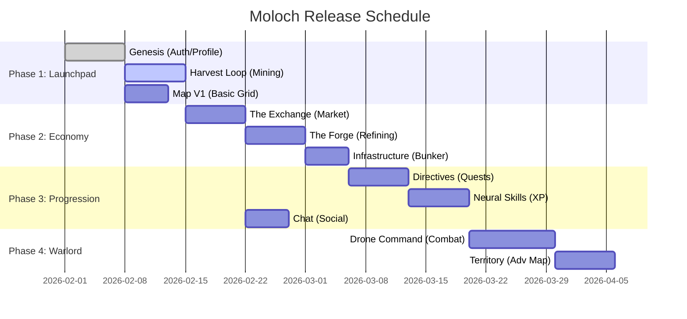
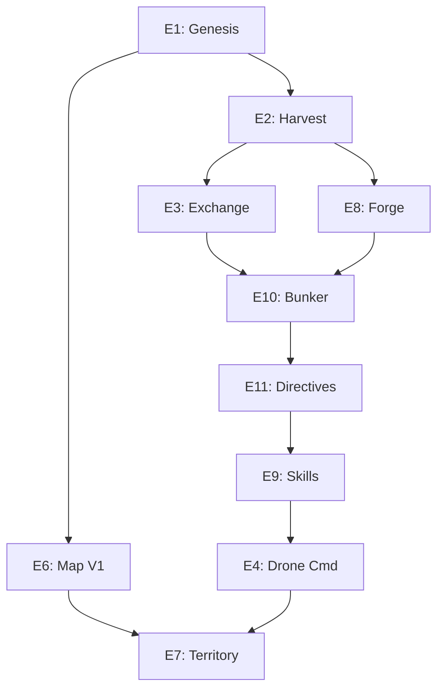

# Moloch Story Map

## Executive Summary

This document visualizes the release strategy for **Moloch**, breaking down the 11 Epics into logical release phases to ensure a playable loop is delivered early and then expanded upon.

## Release Phases

## Detailed Flow

### Phase 1: The Launchpad (Foundation)

**Goal:** A player can login, spawn on Mars, and mine a rock.

- **Epic 1: Genesis** - User Auth, Persistent Profile.
- **Epic 6: The Red Frontier (Part 1)** - Spawning logic, Sector viewer.
- **Epic 2: Harvest Loop** - Mining timers, Inventory backend.

### Phase 2: The Industrialist (Economy)

**Goal:** A player can refine ore and sell it to others.

- **Epic 3: The Exchange** - Buying/Selling on global market.
- **Epic 8: The Forge** - Converting Ore -> Alloys (adding value).
- **Epic 10: Infrastructure** - Building upgrades to increase limits.

### Phase 3: The Specialist (Progression)

**Goal:** Players specialize into Roles (Triangle of Efficiency).

- **Epic 11: Directives** - Contracts to earn Credits & Skill Points.
- **Epic 9: Neural Conditioning** - Spending SP to unlock efficiency bonuses.
- **Epic 5: Comm-Link** - Global chat to facilitate deals.

### Phase 4: The Warlord (Conflict)

**Goal:** Players fight for territory and resources.

- **Epic 4: Drone Command** - TGR Combat Resolver, Swarm Config.
- **Epic 7: Industrial Ownership** - Claiming plots, PVP over resources.

## Dependency Graph

